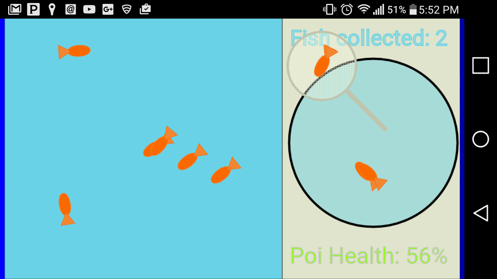

#Kingyo Sukui

## Objectives
Get as many goldfish as you can before your scoop breaks.

##Items
+ A pool of fish
+ A bowl
+ A poi (or paper scooper)

## Gameplay
The game starts with a number of goldfish swimming in a shallow pool.  The player has to scoop the fish with the poi and place them in the bowl. Because it is made of paper, the poi won't hold fish very long.  The longer the poi is in the water, the weaker it is.  The weight of the fish also weakens the poi.  If the poi is too weak it will break.  How many fish can you get before your poi breaks?  Play the game and see!

##Ganbatte ne!
<a href="http://navyvet1125.github.io/Kingyo_Sukui/" target="_blank">Let's Play!!!</a>